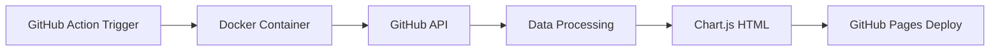

# 📊 repo-stats-dashboard — GitHub Action for Interactive Repository Statistics

> **A Docker-based GitHub Action that generates beautiful HTML dashboards of your repository's stats — stars, issues, pull requests, and commits — ready for GitHub Pages deployment. Track your open source growth with interactive Chart.js visualizations.**

[](https://github.com/SCL339/repo-stats-dashboard/releases)
[](https://github.com/marketplace/actions/repo-stats-dashboard)
[](LICENSE)
[](https://github.com/SCL339/repo-stats-dashboard)
[](https://github.com/SCL339/repo-stats-dashboard/issues)
[](https://github.com/SCL339/repo-stats-dashboard/blob/main/Dockerfile)
[](https://python.org)

---

## 📖 What Is repo-stats-dashboard?

**repo-stats-dashboard** is a **GitHub Action** that automatically generates an interactive, visually appealing HTML dashboard showing your repository's key metrics over time. It uses **Chart.js** for smooth interactive charts and produces static HTML that deploys seamlessly to **GitHub Pages** — completely free.

**Perfect for:**
- 🏆 **Open source maintainers** tracking project growth
- 📈 **Developers** wanting beautiful repo analytics
- 🚀 **Teams** monitoring multiple repository metrics
- 📊 **Anyone** who wants to visualize their GitHub stats

---

## ✨ Features

| Feature | Description |
|---------|-------------|
| 📈 **Time-Series Charts** | Interactive Chart.js line charts for stars, issues, PRs, and commits |
| 🏷️ **Repo Overview** | Language, license, topics, fork/watcher counts at a glance |
| 💻 **Recent Commits** | Latest 50 commits with SHA, message, author, and date |
| 🐛 **Open Issues** | Filtered list with labels, comments, and status |
| 🔀 **Open PRs** | Draft status, labels, and review info |
| 🌙 **Dark Theme** | Matches GitHub's dark mode aesthetic perfectly |
| 🚀 **Pages-Ready** | Outputs static HTML for instant GitHub Pages deployment |
| ⚡ **100% Automated** | Runs on schedule or workflow dispatch |

---

## 🚀 Quick Start

Add this workflow to your repo at `.github/workflows/stats-dashboard.yml`:

```yaml
name: Stats Dashboard

on:
  schedule:
    - cron: '0 6 * * *'   # every day at 06:00 UTC
  workflow_dispatch:       # manual trigger

permissions:
  contents: read
  pages: write
  id-token: write

jobs:
  build-dashboard:
    runs-on: ubuntu-latest
    steps:
      - uses: actions/checkout@v4

      - name: Generate repo stats dashboard
        id: dashboard
        uses: SCL339/repo-stats-dashboard@v1
        with:
          token: ${{ secrets.GITHUB_TOKEN }}
          days: 30

      - name: Upload Pages artifact
        uses: actions/upload-pages-artifact@v3
        with:
          path: ${{ steps.dashboard.outputs.dashboard-path }}

  deploy:
    needs: build-dashboard
    runs-on: ubuntu-latest
    environment:
      name: github-pages
      url: ${{ steps.deployment.outputs.page_url }}
    steps:
      - name: Deploy to GitHub Pages
        id: deployment
        uses: actions/deploy-pages@v4
```

---

## ⚙️ Inputs

| Input | Description | Required | Default |
|-------|-------------|----------|---------|
| `token` | GitHub token with repo access | No | `${{ github.token }}` |
| `owner` | Repository owner (user or org) | No | `${{ github.repository_owner }}` |
| `repo` | Repository name | No | `${{ github.event.repository.name }}` |
| `days` | Number of days of history to display | No | `30` |
| `title` | Custom title for the dashboard page | No | `Repository Stats Dashboard` |
| `output_dir` | Directory to write `index.html` | No | `dashboard` |

## 📤 Outputs

| Output | Description |
|--------|-------------|
| `dashboard-path` | Absolute path to the generated `index.html` |

---

## 🔧 How It Works



1. **Triggered** by schedule or workflow dispatch
2. **Runs** in a lightweight Docker container
3. **Fetches** stats from the GitHub API (stars, issues, PRs, commits)
4. **Generates** a standalone HTML file with embedded Chart.js
5. **Outputs** the HTML for GitHub Pages artifact upload

---

## 📋 Example Dashboard

Your generated dashboard will include:

- **Interactive line charts** — hover for data points, zoom/pan
- **Summary cards** — total stars, open issues, open PRs, total commits
- **Repo metadata** — language breakdown, license, topics
- **Activity timeline** — commit history with author names
- **Issue tracker** — open issues with labels and comment counts
- **PR dashboard** — open PRs with draft status

---

## 🐳 Local Development

```bash
# Clone the repo
git clone https://github.com/SCL339/repo-stats-dashboard.git
cd repo-stats-dashboard

# Build the Docker image
docker build -t repo-stats-dashboard .

# Run locally
docker run --rm \
  -e INPUT_TOKEN=your_github_token \
  -e INPUT_OWNER=SCL339 \
  -e INPUT_REPO=repo-stats-dashboard \
  -e INPUT_DAYS=30 \
  -e INPUT_TITLE="My Dashboard" \
  -e INPUT_OUTPUT_DIR=/github/workspace/dashboard \
  -v $(pwd)/output:/github/workspace \
  repo-stats-dashboard
```

---

## 🔗 Related Projects

| Project | Description |
|---------|-------------|
| [whatsnew-cli](https://github.com/SCL339/whatsnew-cli) | Terminal CLI for tracking daily GitHub commits |
| [SCL339 Profile](https://github.com/SCL339/SCL339) | Full-stack developer profile with live stats |

---

## 🤝 Contributing

Contributions welcome! Open an issue or PR for:
- New chart types
- Additional metrics (contributors, forks, releases)
- Custom themes
- Multi-repo dashboard support

---

## 📄 License

MIT © [SCL339](https://github.com/SCL339)

---

<p align="center">
  <a href="https://github.com/marketplace/actions/repo-stats-dashboard">
    
  </a>
  <a href="https://github.com/SCL339/repo-stats-dashboard">
    
  </a>
</p>
